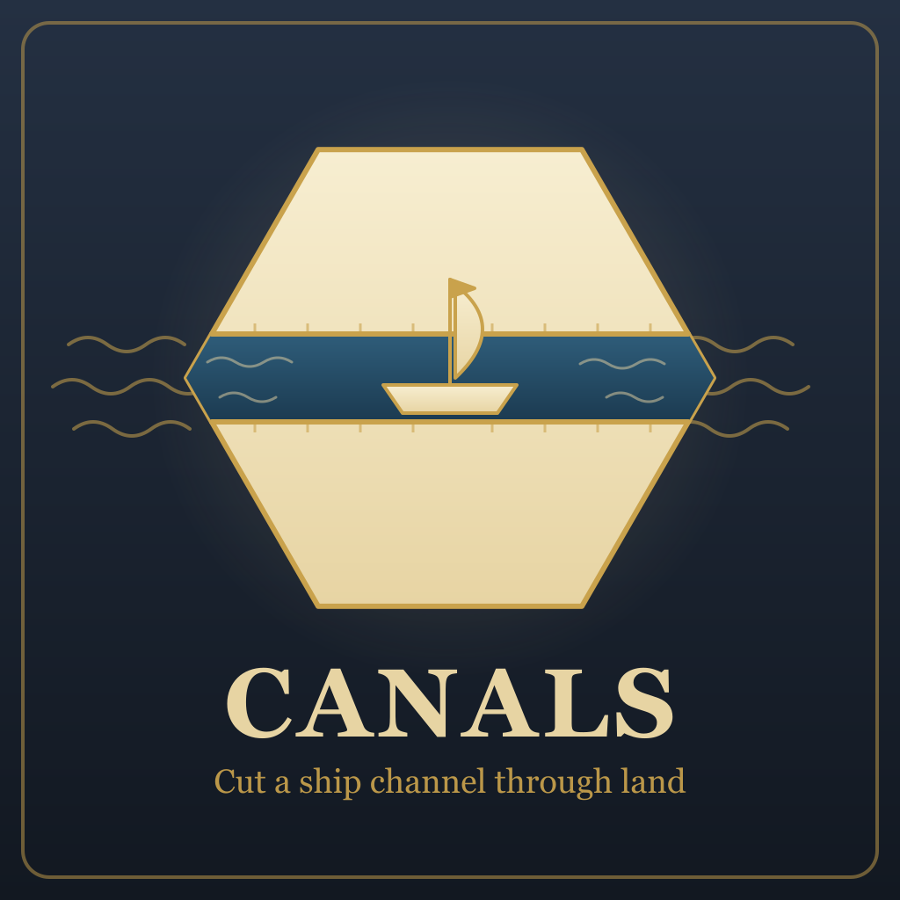
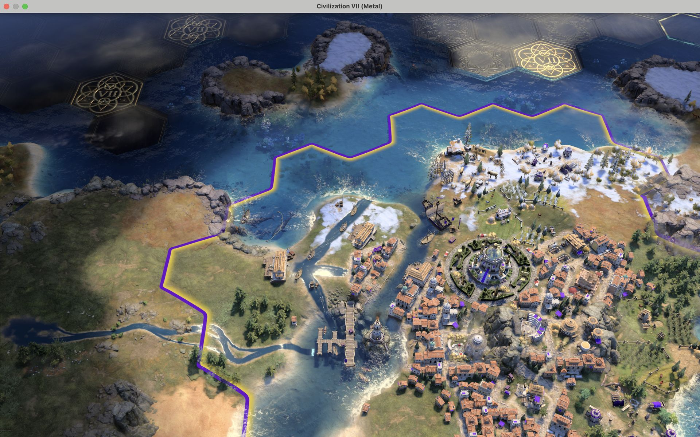
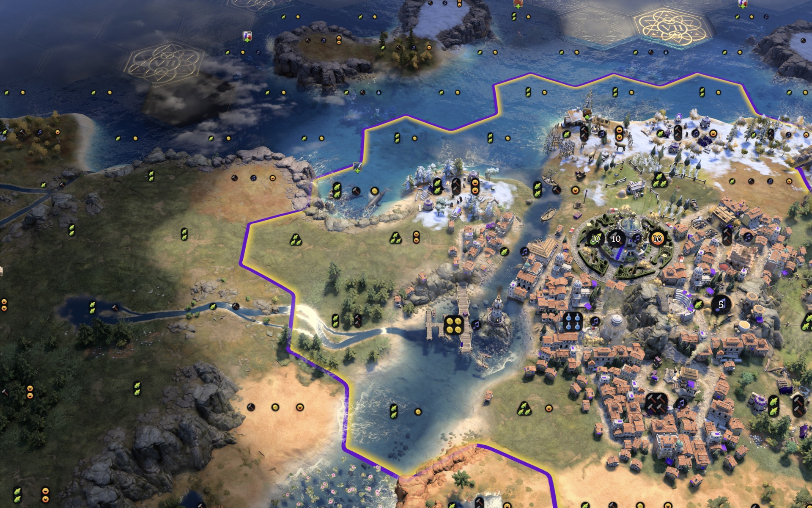
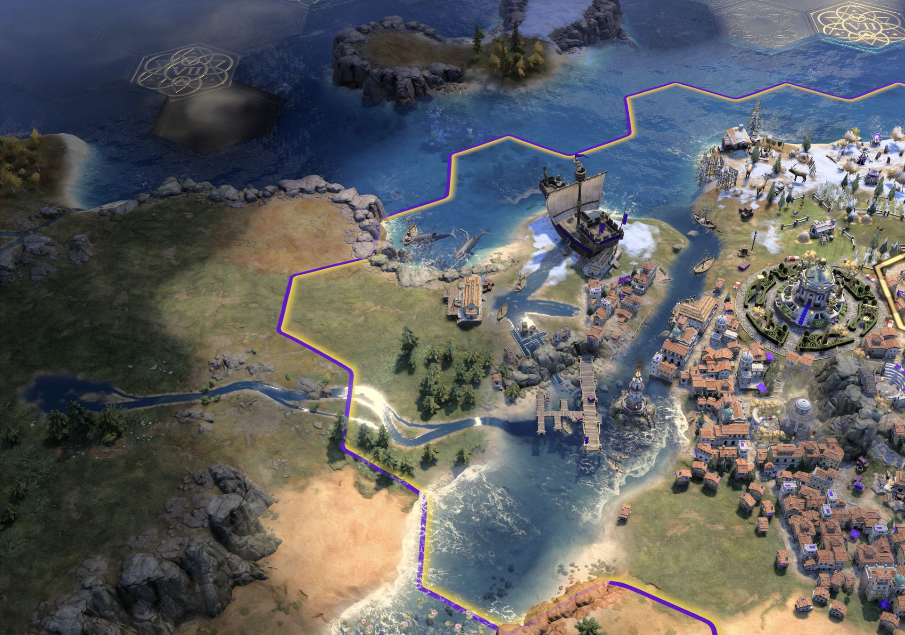
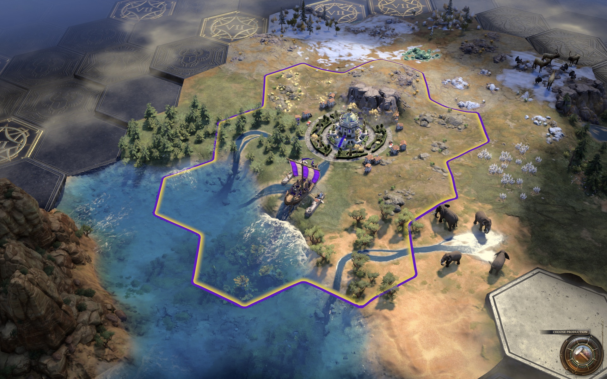
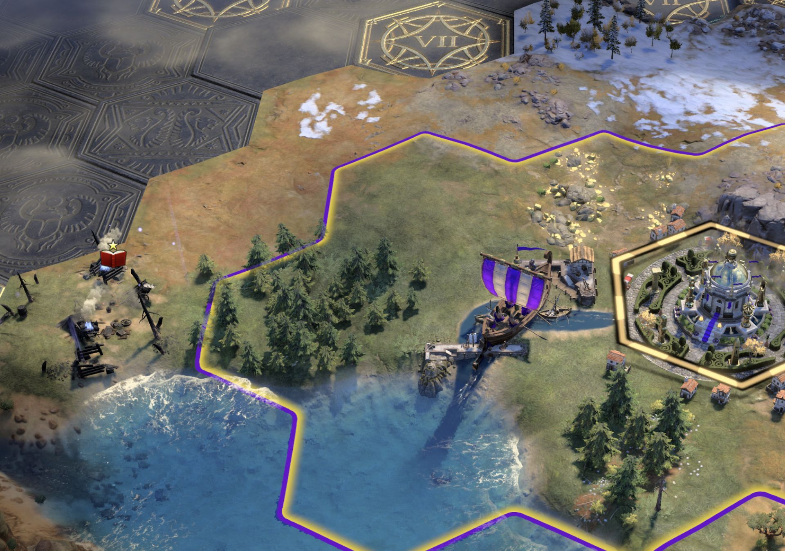
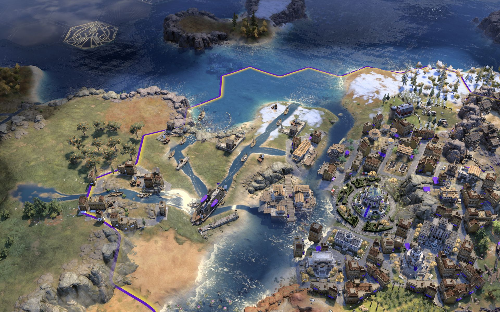
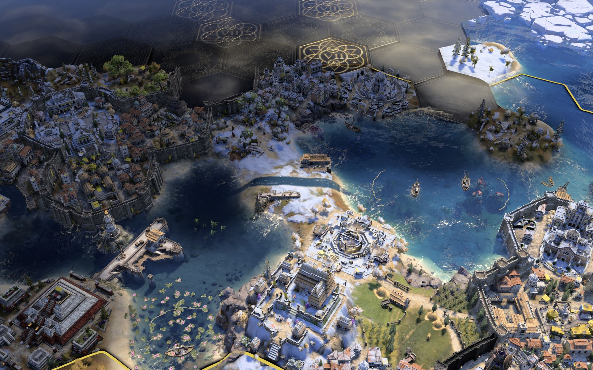
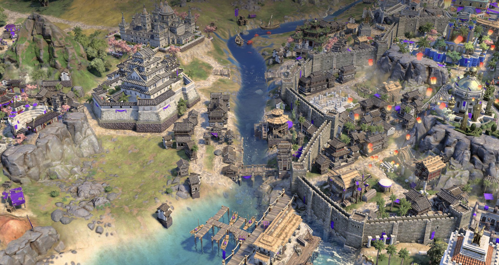

<p align="center">
  
</p>

# Canals

A Civilization VII mod. Build a Canal on a land tile beside the water. When it is finished the tile becomes
water, drawn as a canal for its age, and ships sail straight through it; dig the next tile inland and the cut
grows. It stays a canal across
every save and reload, and the AI digs canals and sails through them too.



*A two-tile Exploration cut at Roma, joining the northern sea to the city's estuary, after a save and reload.
The channel, the quays and the moored boats are drawn by the mod; the canal is still water, and still a canal.*

The Canal is an ordinary building in the production list, and a town buys it with gold like any other building.
Each age has its own Canal, unlocked by one of that age's techs, and a settlement can dig as many canals as it has
sites for. The mod decides where a Canal may go, turns
the tile into water when it completes, and dresses it. Everything else, the ship pathing, the
tile's ownership, the citizen who works it and the yields it gives, is the game's own state.

---

## What the player does

Pick the Canal in a city's production list, or buy it with gold in a town's purchase list (or a city's). It is a
building; each age has its own, unlocked by a tech, and a settlement can have any number of them, one per site:

| Age | Building | Unlocked by | Production cost |
| --- | --- | --- | --- |
| Antiquity | Ancient Canal | Engineering | 300 |
| Exploration | Medieval Canal | Shipbuilding | 500 |
| Modern | Modern Canal | Industrialization | 800 |

A bought Canal is finished at once: the tile turns to water as soon as the purchase goes through.

On the placement screen the settlement offers its land tiles that touch water a ship can sail (sea, lake,
navigable river, or a canal already dug): a tile it works, a bare tile within its build ring, or an urban tile
whose buildings are all from an earlier age. Where the cut goes, and whether it ever meets the far shore, is the
player's call.



*The site before the first Canal is ordered: the neck of land between Roma's estuary and the northern sea.*

Choose a tile. The settlement builds the Canal there like any other building; a bought one is finished at once
and opens within a second. The tile keeps, or gets, a rural district, so no houses ever appear on it; only a
quarter the canal replaces has its houses taken down when the canal opens.

When the Canal completes, the tile turns to water and is drawn as a canal at once, dressed for the age it was dug
in: a water channel cut through the land between the shores it joins, boats moored where it meets open water, and
along the banks an Antiquity harbor with its stone quay, or Exploration houses and a wharf lining the channel, or
Modern buildings and a harbor. Any ship can now path through the tile between the two waters, in the same turn.
The channel runs between two shores rather than toward every side the tile has water on, so a tile standing in open
water is not drawn as a star. Where the canal touches another body of water as well, a lake beside the cut for
instance, one branch opens into it, from whichever tile of the canal suits it best, so it is plain that ships can
come in that way too.



*The finished cut with a Cog sailing through. Each Canal that opens beside an earlier one redraws both, so the
channels meet and the cut reads as one waterway.*

## Longer canals

A canal is dug from the shore inward: once a tile is water, the land tile beside it touches water and can be the
next Canal. A queued Canal counts as part of the run, so the next tile can be ordered while the first is still
being dug; ships pass once every tile of the run is finished. Each age has a longest run:

| Age | Run |
| --- | --- |
| Antiquity | 1 tile |
| Exploration | up to 2 tiles |
| Modern | up to 5 tiles |

Runs may bend and branch, as long as every tile of the run reaches open water through it. A junction where a
branch leaves the main cut is drawn as an open basin, with no houses on it. In Antiquity the tiles beside an
existing or queued canal are not offered, so a canal is always a single tile.

A canal can cross from one settlement's land into another's: each tile is built or bought by the city or town that
owns it, and a tile beside another settlement's canal is offered as the next tile of that canal. City and town, two
towns, or two cities make one waterway alike.



*An Antiquity canal dug from the city's own tile to the sea, with a Galley in the channel. A settlement center
counts as a canal end, so a city or town can open its center to the water.*



*The same canal after a save and reload: the quay, the boats and the channel through the land are all still there.*

## One-tile canals

The age rules above are the default. Options, Add-ons, Canals has a **Canal rules** setting that switches to
one-tile canals instead:

| Rules | Canal | Unlocked by | Production cost | Food | Gold | Length |
| --- | --- | --- | --- | --- | --- | --- |
| One-tile canals, any age | Canal | Irrigation in Antiquity; nothing in later ages | 400 | 2 | 2 | always 1 tile |

With one-tile canals the three age Canals are not offered. A single Canal takes their place in every age, with the
same cost and yields whatever the age. It is drawn in the style of the age being played: the harbor and quay of
Antiquity, the houses and wharf of Exploration, the buildings and harbor of Modern, so a canal dug in Antiquity is
redrawn in each new age's style. It qualifies on the same tiles as an Antiquity canal: a land tile beside water a ship can
sail, never next to another canal, dug or queued. Every ship that can reach it can pass it, as many each turn as
want to.

The setting chosen in the main menu applies to new games. A game keeps the setting it was first loaded with, and the
setting can be changed during a game from the same Options screen; the change applies to that game from then on.
Canals already dug keep the rules they were dug under, and a Canal already ordered is finished under its own rules.
AI players follow the rules in play: the mod marks their sites for the Canal on offer, and the game offers them that
Canal only.

## Civilopedia

The Civilopedia's Game Concepts section has a Canals group with four pages: Canals (what a Canal is, each age's
Canal, one-tile canals, building one and what happens when it opens), Canal Sites, Longer Canals, and Ships and Yields.

## Which tiles qualify

- flat or hill land the settlement owns, not a navigable river tile;
- a tile the settlement works, a bare tile within its build ring, or an urban tile whose buildings are all from an
  earlier age, which the canal replaces; a tile holding a building of the current age, or an ageless one, is not
  offered;
- beside water a ship can sail: sea, lake or navigable river on at least one side; water nothing can enter is not a
  way in: ice, or a natural wonder standing in the sea, such as Thera; a settlement's own center beside the tile
  counts as well, so a city or town can dig a canal from its center out;
- or beside an existing or queued canal, as the next tile of that run, within the age's longest run;
- no unit standing on it;
- no resource on it: a tile holding a resource can take no building, and the Canal is one;
- not already a canal, dug or queued.

## What it gives, and what it costs

The Canal, like other buildings, takes one citizen to build. When it completes that citizen moves onto the
finished canal, which becomes a worked fishing tile of the city, and the Canal building stays on it as an
ordinary building of the city with its own yields, by the age it was dug in. All of it is ordinary city yield,
counted where the city counts everything else. If the city cannot place the citizen on the canal itself, the
tile still becomes a rural tile of the city and the citizen is left for you to place.

| Canal | Food | Gold |
| --- | --- | --- |
| Antiquity | 2 | 2 |
| Exploration | 3 | 4 |
| Modern | 4 | 6 |

Any number of ships can pass a canal each turn, in every age. Up to 1.5.1 an Antiquity canal took one of your ships
a turn and an Exploration canal two; that limit is still in the script but switched off (`TRANSIT_LIMIT` in
`ui/canals.js`).

The cost is the production and the tile: the rural improvement on it, if any, is gone, and the tile is water
from then on.



*A Modern run of five Canals at Roma that bends and branches between the northern sea, the estuary and the river,
with an Ironclad in the channel and the age's harbors and buildings along the banks.*

## Cliffs and locks

A canal can be cut through a tile with cliffs on its edges. The cliffs stop mattering the moment the canal opens:
ships cross every edge of the tile. The rock faces themselves stay in the picture until the game is next loaded,
so where a channel meets a cliff shore the canal is drawn stepping down through a lock: a stone chamber with gates
across the channel, a gatehouse on one bank, a water wheel on the other, and water spilling over the cliff foot
beyond the gates. This is cosmetic only.

## AI canals



*A canal an AI player dug on its own land, joining a lake to the sea across a snowy neck.*



*Another AI canal, cut through the houses of a town from the river down to its harbor.*

AI players build Canals themselves, as they build any building, and only on a canal site. For each AI the mod marks
every tile of its settlements where a canal is worth digging: where it saves a ship at least six tiles of sailing
round, or opens a lake or sea of ten tiles or more. The game offers an AI the Canal on those tiles and nowhere else,
and the AI decides when to build it, with production or gold. Its canals open and are drawn like yours, and its units
sail through them.

## Compatibility

- Adds three buildings and their tech unlocks, a fourth building for one-tile canals, and two canal-site markers (one
  per set of rules): map features with no look and no yield of their own, which the mod places on the tiles where a
  Canal may go. Changes no base-game rows, replaces no base-game files.
  Saves keep the markers; a save loaded without the mod has none.
- How much the AI values a Canal is read when a game is created, so it holds in games started with this version. In a
  game already under way the AI can still build on its canal sites, but chooses to less often.
- A save loads with the mod on or off. Saves hold each canal as the land it was cut from, and the mod turns it back
  to water when the game is loaded with the mod on. Without the mod a dug canal is a plain land tile of the city: its
  fishing boat and district stay, the Canal building and its yields go, and a ship left in the canal is stranded on
  the land. Move your ships out of the canals before you remove the mod.
- Added to a game already under way, after the Canal's tech was researched, the game keeps that age's Canal locked.
  The mod then sells it for gold in each settlement's purchase list instead of production, and says so once.
- While a canal is open the mod writes the autosave itself, at the start of your turn, on your own frequency and keep
  count. The files carry on the game's own series (AutoSave_01_0072 and onward), so the newest is at the top of the
  Autosaves tab and is the one Continue loads. The game's own autosave is held meanwhile; your setting is put back
  whenever the main menu loads.
- A save from Canals 1.0.0 holds its canals as open water, so they load drawn as open sea. The mod offers to reload
  at once, which draws them as canals; otherwise they look right after your next save and load.
- Works with [National Park](https://github.com/tmtmiller1/civilizationvii_national-parks): park land is never offered as a
  Canal site, and a Canal ordered onto it is refused, whichever of the two mods loads first.
- Works with [Dams](https://github.com/tmtmiller1/civilizationvii_dams): a Dam cannot be built on an opened canal, and a
  Canal is never offered on a tile that holds a Dam.
- Single-player games only. In a multiplayer game no Canal can be built, and the mod says so when the game starts.
- Translated into German, Spanish, French, Italian, Japanese, Korean, Polish, Brazilian Portuguese, Russian, and
  Simplified and Traditional Chinese. The translations are machine-made; corrections are welcome.

## Installation

1. Subscribe on the Steam Workshop, or download the zip from the
   [latest release](https://github.com/tmtmiller1/civilizationvii_canals/releases/latest).
2. Unzip it so the `canals` folder sits in the Civilization VII Mods directory.
3. Enable **Canals** from Additional Content in-game.

---

## How it works

Seven steps. The runs behind each of them, on Civilization VII 1.5.0, are in
[docs/verification-runs.md](docs/verification-runs.md).

1. Placement. The Canal buildings carry no terrain rule of their own. The mod wraps the engine's placement
   queries, for production and for purchase with gold (a town's only way to get a building): for a Canal, the
   offered plots are the settlement's worked and bare tiles within its build ring, and the urban tiles the engine
   itself offers a plain building of the age through the same path, narrowed to the tiles that pass the rule
   above; the per-plot check refuses anything else with the mod's own message. The engine's verdict on *whether* a Canal may be had (locked, already queued) is kept, and the mod adds
   the gold check the engine makes only on a marked tile, so a town's list greys a Canal it cannot afford.
2. Commit. A bare tile first gets a rural district, held by the city (the engine takes a Canal on a rural
   district as on any worked tile, in a town as in a city, and a rural district draws no houses). The engine takes
   a Canal only on a tile holding the site marker (step 6), so the mod marks the chosen tile, waits for the
   engine's own per-plot yes, removes any obsolete building on the tile, and forwards the order. The engine places
   the Canal on the district the tile has; no urban district is made. A bought Canal arrives complete and the engine sends no completion event for it,
   so the mod opens it straight away. The plot is remembered in the save, so a reload mid-construction still
   finishes the job.
3. Completion. When the Canal completes, the handler retypes the tile to coast (the feature cleared first) and
   draws the canal at once, under the game's own construction dust, which covers the site from the order until the
   canal is settled. On a rural tile the Canal stays where it is and a fishing boat takes the improvement's
   place: the tile is a worked fishing tile of the city with the Canal on it, within a second. On an urban tile
   (a quarter the canal replaced, or a Canal begun under 1.4.3) the Canal and the district go,
   the released plot is bought back for the city, the Canal's citizen is placed on the new water tile with the
   city's own expand order (a rural district with fishing boats), and the Canal is re-created on that rural
   district, where its yield rows count in the city at once.
4. The passage. A tile retyped to coast is pathable by ships immediately: a ship's path to the far side goes
   from around the land to through the tile in the same turn. The tile's
   area id does not change until the age transition, which is why the placement rule resolves a canal tile's
   waters through its neighbors rather than its area.
5. The look. A retyped hex keeps its land mesh, and a load draws it as land too (step 7), so the canal is
   drawn by script from
   shipped meshes: river channel pieces meeting at the hex center - one to each canal beside it, the two shores
   that lie most nearly opposite, and one branch into each other body of water the canal touches - the age's
   houses and harbor along the first arm, moored boats where the canal meets open water or a junction, and lock
   pieces at any shore that was a cliff. Three looks per age, chosen by plot number so a canal keeps its look
   across reloads.
   The opened canals are kept in the save and redrawn on load and at the start of every turn.
6. Canal sites and AI canals. The canal rule is the mod's own; the game's data cannot express it, and the
   game's AI obeys only the data. So each Canal requires a canal site on its tile, a map feature with no look and no
   yield of its own that the mod places. At the start of each of your turns the mod marks, for every AI, each tile
   of its settlements where a canal is worth digging, and your own order marks its tile as you place it. The game
   then offers an AI the Canal on its sites alone, and the AI builds it there when it chooses, like any building; the
   AI values a Canal highly, which is safe because it can build one only where one pays. The canal opens as yours
   do, and AI units sail through it.
7. Saving. A load draws each hex from the terrain in the save, and a coast hex comes out as open sea, so every
   save holds the canals as land. The terrain must change before a save starts, never during one: a retype while
   the game is writing a save crashes it. Every save goes through the game's save call, which the mod wraps: the
   canals turn to land, the save is sent once the map reads them as land, and they are coast again when it completes.
   The game's autosave comes too soon after the AI turns for that, so the mod writes the autosave itself at the start
   of your turn; the canals are water through every AI turn. After a load they stay land until the game
   has started and the save the engine makes on loading an autosave is done, then turn coast; the land mesh the
   load drew stays in place under the mod's channel. When an age ends the canals turn to land and stay land, so
   the next age, which is built from the map the old one leaves, loads them as land like any save.

A safety sweep on load and at the start of every turn re-checks every remembered site and every complete Canal
on the map, so a missed completion event is caught on the next turn. A completed Canal that shares its tile with
other buildings (an AI's, in an urban slot) or does not sit on a canal site is left alone as a building.

## Status

Tested end to end on Civilization VII 1.5.0, between 2026-09-25 and 2026-09-29, in games of all three ages:
placement through the real production screen, the district and the build order, the completion handler opening the
canal, the citizen placed and the yields counted in the city, a Galley, a Cog and an Ironclad each sailing through,
the three-tile Exploration cut and the Modern trunk ordered in sequence through the real build path, the lock
dressing at a cliff shore, and short AI soaks with the Canal unlocked for every player without a crash. A town bought
a Medieval Canal through the purchase path: the placement screen offered the canal site alone, the canal opened at
once, the gold was charged once and a Cog sailed through. Each age's Canal appears in the lists a player reads it
from, named and with its own icon: the city's production list, the city's purchase tab and a town's purchase list.
On a canal opened through the real build path, the autosave, a script save and a quicksave through the game's own
save model each wrote the canal as land, with no crash; the script save and the mod's own autosave each reloaded with
the canal drawn through land and a ship pathing through it, and the canal was water through every AI turn. The AI's
embarked units moved through an AI canal on three turns. A two-tile cut held by two cities, one built with production
and one bought, carried a ship through on the release build. An age transition with a canal open went through without
a crash: the canal crossed into the Modern age as land, kept its record, and was drawn as a canal through the land
once the new age loaded. Five Modern canals dug through the real build path reloaded drawn as canals. A save holding
a canal as water (from Canals 1.0.0) was offered a reload, and after it the canal was drawn through land. The mod's
autosaves carried on the game's own series and were what the load list and Continue showed first. In a game the mod
was added to after Engineering, a town bought the Canal from the mod for gold, charged once, and it opened.

Canal sites, in Exploration games: with the Canal requiring a site, the game's own AI weighed it only on marked tiles
and never put one anywhere else over 49 turns, although every AI had the tech. An AI chose a Canal on its own marked
site, built it and the canal opened. Your own Canals, built and bought, marked their tiles and opened as before, and
a marked tile yielded exactly what it did unmarked, through a save and reload.

Not tested:

- A Modern branch built through the real build path: the branch tile was offered, but the engine dropped that one
  build order with no reason code in the gallery run, so branching was only checked by retyping the tiles
  directly.
- The second and third look of each age as whole compositions (their pieces were photographed individually).
- An AI warship crossing between two seas through a canal: the AI units seen in canals were embarked land units.
- The age transition through the game's own end-of-age screens: the tested one ran under Autoplay.
- A ship's path through a canal after an age transition.
- Canal sites in an Antiquity or a Modern game. The same site rule covers all three ages' Canals; the AI's own
  canals were only tested in Exploration games.

Known limits:

- Multiplayer: the retype is a local call, so the mod does not offer the Canal in a network game.
- A save from Canals 1.0.0 draws its canals as open sea until it is saved and loaded once more.
- In a game Canals was added to after the Canal's tech was researched, the game keeps that Canal locked for the AI
  until the next age: the mod sells it to you for gold, but the AI builds only what the game unlocks for it.
- The AI builds a Canal only where its city could put a building: an urban tile, or a rural tile its urban core can
  grow onto. A marked site further out waits until the city grows toward it.
- A canal cannot be pillaged. Ships pillage by Coastal Raid, and the game never offers a raid on a water tile that
  holds a building; the Canal stays on the finished tile as one. A ship in an enemy canal can still Coastal Raid the
  tiles around it, as from any coast.

## Layout

```
canals.modinfo                      data and one script
data/canals.xml                     the three Canal buildings: cost, citizen, yields, districts
data/canals-antiquity.xml           each age's tech unlock, loaded only while that age is in use
data/canals-exploration.xml
data/canals-modern.xml
data/canals-civilopedia.xml         the Canals pages in the Civilopedia's Game Concepts section
ui/canals.js                        the mod: placement, commit, completion, looks, locks,
                                    ship limit (off), saving, AI canals, safety sweep
ui/canals-shell.js                  main menu: puts the player's autosave frequency back
text/en_us/CanalsText.xml           name, description, placement messages and the Civilopedia text
text/<lang>/CanalsText.xml          the same text in each of 11 other languages (see text/README.md)
tests/pedia-pages.test.mjs          checks every Civilopedia page has text to draw (npm run pedia)
tests/i18n.test.mjs                 checks every translation has every tag, placeholder and markup (npm run i18n)
devtools/gen-glossary.py            pulls the game's own translations of game terms into devtools/glossary/ (local, not committed)
docs/verification-runs.md           every step and the run behind it
docs/steam-workshop-description.txt the Workshop page text
docs/workshop-preview.png           the mod icon and Workshop preview (rendered from workshop-preview.svg)
gallery/                            the screenshots used above
scripts/build_readme_pdf.sh         builds README.pdf from this file (npm run readme:pdf)
scripts/steam-changelog.mjs         renders CHANGELOG.md into CHANGELOG.steam.txt for the Workshop
release.sh                          builds the release zip and the Workshop manifest into dist/
CHANGELOG.md                        what changed in each version
README.pdf                          this file, typeset
```

In a running game, `globalThis.__canals.enabled = false` makes every hook pass straight through, and
`globalThis.__canals.uninstall()` restores the engine's own methods; both are for troubleshooting.

The routes that were tried and set aside, the probes and the harness runs live in the author's working tree
(`mod_ideas_tested/canals`), outside this folder.

## Credits

Built by Tower.
