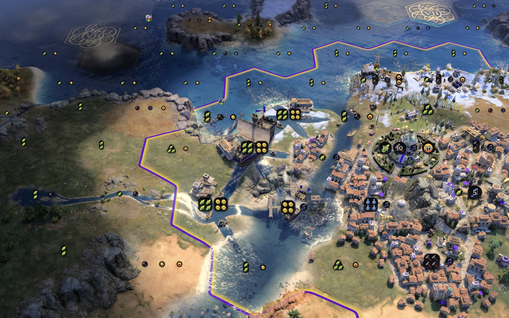
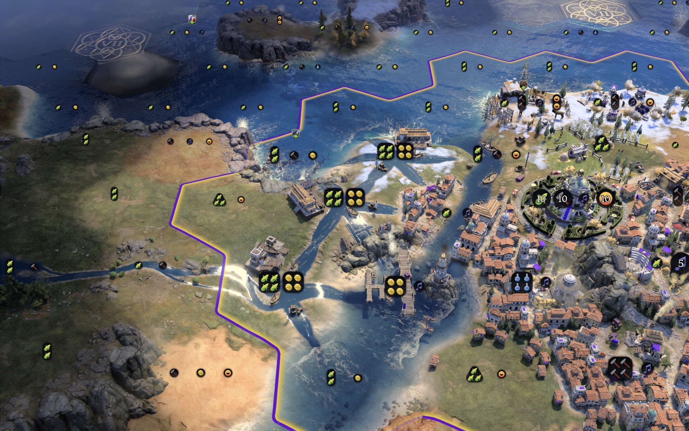
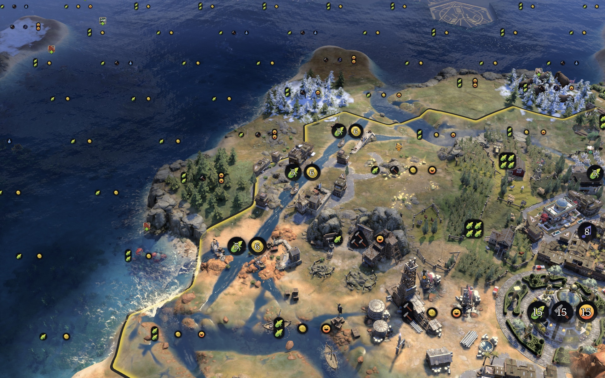
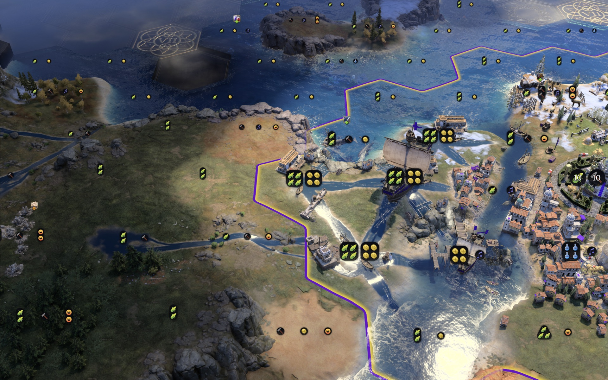
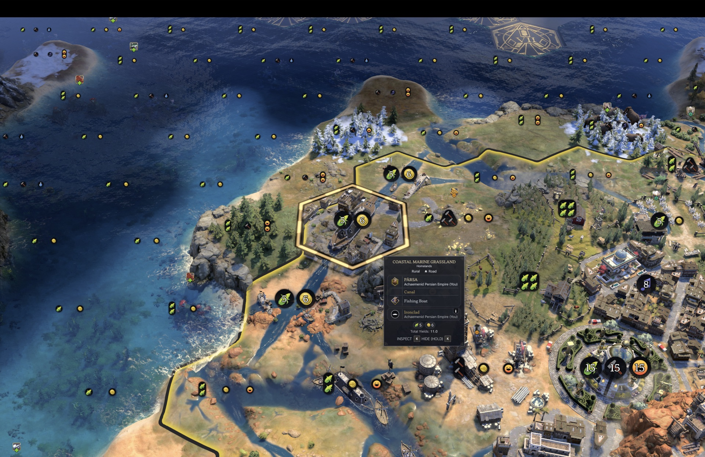
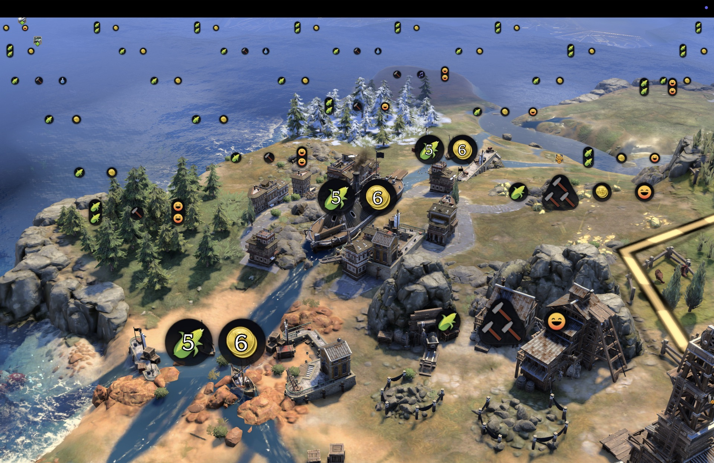
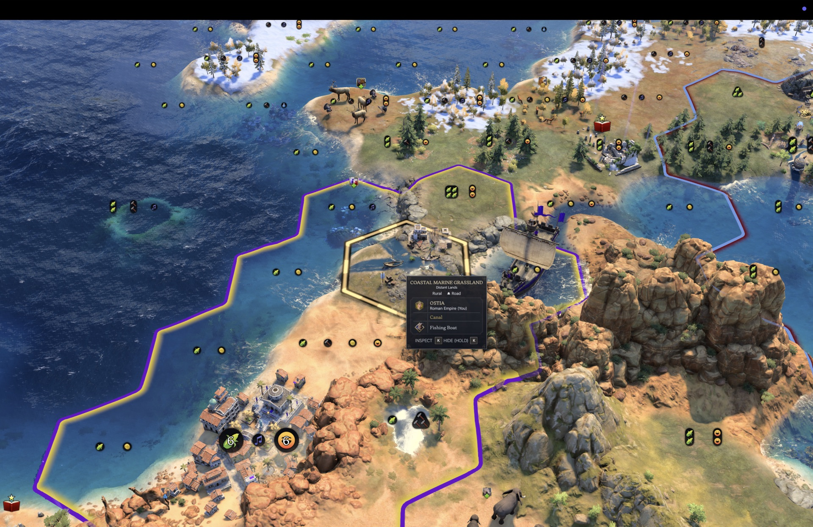
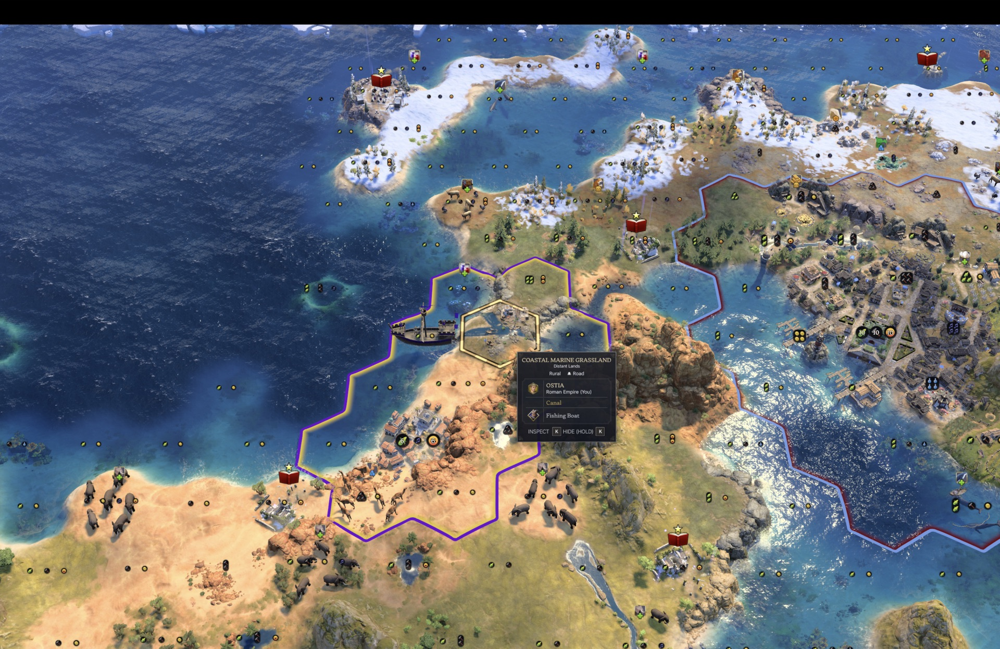

<p align="center">
  
</p>

# Canals

A Civilization VII mod. Build a Canal on a narrow neck of land between two bodies of water. When it is finished
the tile becomes water, drawn as a canal for its age, and ships sail straight through it.



*An Exploration-age cut of three Canals, joining Roma's estuary to the northern sea. The channel, the houses and
wharfs along its banks and the moored boats are drawn by the mod; the Cog's route through it is the game's own.*

The Canal is an ordinary building in the production list, one per age, unlocked by a tech. The mod decides where
it may go, turns the tile into water when it completes, and dresses it. Everything else, the ship pathing, the
tile's ownership, the citizen who works it and the yields it gives, is the game's own state.

---

## What the player does

Pick the Canal in a city's production list. It is a building, one per age, unlocked by a tech:

| Age | Unlocked by | Production cost |
| --- | --- | --- |
| Antiquity | Engineering | 300 |
| Exploration | Shipbuilding | 500 |
| Modern | Industrialization | 800 |

On the placement screen the city offers only the tiles a canal makes sense on. In Antiquity that is a land tile
the city owns with water on at least two separate sides: a strip of land between two shores. Sea, lake and
navigable river all count, so a canal can join a river to the sea or two reaches of a river. Three coast tiles on
one side and one on the other qualifies; a headland with all its water in one stretch does not.


*The site before the first Canal is ordered. The neck of land between Roma's estuary and the sea is three tiles
across, which the Exploration age allows.*

Choose a tile. It becomes an urban district holding the Canal under construction, and the city builds it like any
other building.

When the Canal completes, the tile turns to water and is drawn as a canal at once, dressed for the age it was dug
in: a water channel cut through the land toward each shore it joins, boats moored where it meets open water, and
along the banks an Antiquity harbour with its stone quay, or Exploration houses and a wharf lining the channel, or
Modern buildings and a harbour. Any ship can now path through the tile between the two waters, in the same turn.



*The finished cut. Each Canal that opens beside an earlier one redraws both so their channels meet, and a longer
cut reads as one waterway.*

## Longer canals

From the Exploration age a canal can be two tiles long: a second Canal is offered on the tile beside the first
that continues it in a straight line, and nowhere else around it. That is the whole Exploration allowance: no
third tile, no bend, no branch. A queued Canal counts as part of the run, so the second can be ordered while the
first is still being dug; ships pass once both are finished.

In the Modern age a run may be up to five tiles long and may bend and branch, as long as every tile of it reaches
open water through the run. A junction where a branch leaves the main cut is drawn as an open basin, with no
houses on it.

| Age | Run | Bends and branches |
| --- | --- | --- |
| Antiquity | 1 tile | no |
| Exploration | a straight line of up to 2 tiles | no |
| Modern | up to 5 tiles | yes |

In Antiquity a canal is always a single tile: the tiles beside an existing or queued canal are not offered. In
every age a tile beside a canal is judged as part of that canal's run; a canal's own water never qualifies a
neighbouring tile as an isthmus by itself.


*An Antiquity canal dug from the city's own tile to the sea, with a Galley in the channel. A settlement centre
counts as a canal end, so a city or town can open its centre to the water.*

## Which tiles qualify

- flat or hill land the city owns, within the city's build ring, not a navigable river tile;
- ship-water on at least two separate sides of the hex: sea, lake or navigable river, in any combination (the
  same sea on both sides counts), ice not counted; the settlement's own centre tile counts as water here, so a
  city or town can dig a canal from its centre out to the sea or a river, and a longer run may start or end at
  the centre;
- from Exploration on, alternatively the tile that extends an existing or queued canal within the age's run rule:
  a straight two-tile line in Exploration, up to five tiles with bends and branches in Modern;
- no building on it yet other than a rural improvement, which is removed when the Canal is placed;
- no unit standing on it.

## What it gives, and what it costs

The Canal, like other buildings, takes one citizen to build. When it completes that citizen moves onto the
finished canal, which becomes a worked fishing tile of the city, and the Canal building stays on it as an
ordinary building of the city with its own yields, by the age it was dug in. All of it is ordinary city yield,
counted where the city counts everything else.

| Canal | Food | Gold | Ships through it per turn |
| --- | --- | --- | --- |
| Antiquity | 2 | 2 | 1 |
| Exploration | 3 | 4 | 2 |
| Modern | 4 | 6 | no limit |

The ship limit holds your own move orders: a move whose path runs through a canal that has already taken its
ships this turn is not sent. The game's AI plots its routes natively and is not held.

The cost is the production and the tile: the rural improvement on it, if any, is gone, and the tile is water
from then on.



*A Modern canal, dug from the ocean to a navigable river, with an Ironclad on its way through. Modern canals
are dressed with the age's harbour and buildings.*

## Cliffs and locks

A canal can be cut through a tile with cliffs on its edges. The cliffs stop mattering the moment the canal opens:
ships cross every edge of the tile. The rock faces themselves stay in the picture until the game is next loaded,
so where a channel meets a cliff shore the canal is drawn stepping down through a lock: a stone chamber with gates
across the channel, a gatehouse on one bank, a water wheel on the other, and water spilling over the cliff foot
beyond the gates. This is cosmetic only.



*Where the channel meets a shore that was a cliff, the canal is drawn as a lock.*

## More canals



*A Modern run of three Canals at Pârsa, cut from the northern sea to the river mouth in the south-west, with an
Ironclad in the channel. The tile tooltip lists the Canal and the Fishing Boat on the tile, and each tile's food
and gold is counted in the city.*



*The same run close up: the Ironclad passing the Modern buildings along the banks, the channel opening onto the
sea beyond the pines.*



*An Exploration-age Canal at Ostia, on distant lands, joining the ocean to the bay behind the coast. The ship is
on the bay side, about to go through.*



*The same canal from further out. The ship is through, on the ocean side, and the canal tile reads as one more
water tile of Ostia.*

## Compatibility

- Adds three buildings and their tech unlocks, changes no base-game rows, replaces no base-game files.
- A save loads with the mod on or off. A canal already dug is ordinary map state: a water tile worked by the city.
  The channel, quay and boats are drawn by the mod while it is on; without it the tile is plain water.
- A game started before the mod was enabled gets the Canal when its unlocking tech is researched; if that tech was
  researched earlier, that age's Canal is not available in that game.
- Single player. In a network game the Canal is not offered.
- English only for now. The mod's text is a handful of strings.

## Installation

1. Subscribe on the Steam Workshop, or download the zip from the
   [latest release](https://github.com/tmtmiller1/civilizationvii_canals/releases/latest).
2. Unzip it so the `canals` folder sits in the Civilization VII Mods directory.
3. Enable **Canals** from Additional Content in-game.

---

## How it works

Five steps, each watched in the game on 2026-09-25 (Civilization VII 1.5.0). The run that proved each one is in
[docs/verification-runs.md](docs/verification-runs.md).

1. **Placement.** The Canal buildings carry no terrain rule of their own. The mod wraps the engine's placement
   query: for a Canal, the offered plots are the city's land tiles within its build ring that pass the rule
   above, and the per-plot check refuses anything else with the mod's own message. The engine's verdict on
   *whether* a Canal may be built (locked, already queued) is kept; the mod decides only *where*.
2. **Commit.** The engine offers buildings only on tiles that already hold an urban district, so a Canal on a
   rural isthmus first gets one, created by script, after which the Canal is offered there and a real build order
   queues it. The plot is remembered in the save, so a reload mid-construction still finishes the job. If the
   engine does not take the build within a few seconds, the district is removed again and the plot bought back.
3. **Completion.** When the Canal completes, the handler retypes the tile to coast (the feature cleared first),
   removes the Canal and its urban district (a district's housing block would hide the canal), buys the released
   plot back for the city, frees the Canal's citizen as a pending point and places it on the new water tile with
   the city's own expand order (a rural district with fishing boats, worked by that citizen), and re-creates the
   Canal building on that rural district, where its yield rows count in the city at once.
4. **The passage.** A tile retyped to coast is pathable by ships immediately: a ship's path to the far side goes
   from around the land to through the tile in the same turn. The retype survives a save and reload. The tile's
   area id does not change until the age transition, which is why the placement rule resolves a canal tile's
   waters through its neighbours rather than its area.
5. **The look.** A retyped hex keeps its land mesh until the next load, so the canal is drawn by script from
   shipped meshes: one river channel piece per water side meeting at the hex centre, the age's houses and harbour
   along the first arm, moored boats where the canal meets open water or a junction, and lock pieces at any
   shore that was a cliff. Three looks per age, chosen by plot number so a canal keeps its look across reloads.
   The opened canals are kept in the save and redrawn on load and at the start of every turn.

A safety sweep on load and at the start of every turn re-checks every remembered site and every complete Canal
on the map, so a missed completion event is caught on the next turn. A completed Canal that shares its tile with
other buildings (an AI's, in an urban slot) or does not sit on a canal site is left alone as a building.

## Status

Watched working end to end on Civilization VII 1.5.0, 2026-09-25, in games of all three ages: placement through
the real production screen, the district and the build order, the completion handler opening the canal, the
citizen placed and the yields counted in the city, a Galley, a Cog and an Ironclad each sailing through, the
three-tile Exploration cut and the Modern trunk ordered in sequence through the real build path, the lock
dressing at a cliff shore, and short AI soaks with the Canal unlocked for every player without a crash.

Not watched:

- A refusal by the per-turn ship limit.
- A Modern branch built through the real build path: the branch tile was offered, but the engine dropped that one
  build order with no reason code in the gallery run, and branching was otherwise proved by retyping the tiles
  directly.
- The second and third look of each age as whole compositions (their pieces were photographed individually).
- A canal opening on an AI player's completion. The handler runs for any owner, but no AI built one in the soaks,
  which were run before the Canal had yields.
- The age transition with a canal on the map. The engine recalculates areas then, which should only make the
  canal more native.

Known limits:

- The hex mesh: a retyped tile keeps its land mesh until the next load, and the mod's overlay stands in for it.
  After a reload the engine draws the tile as water itself.
- Multiplayer: the retype is a local call, so the mod does not offer the Canal in a network game.

## Layout

```
canals.modinfo                      data and one script
data/canals.xml                     the three Canal buildings: cost, citizen, yields, districts
data/canals-antiquity.xml           each age's tech unlock, loaded only while that age is in use
data/canals-exploration.xml
data/canals-modern.xml
ui/canals.js                        the mod: placement, commit, completion, looks, locks,
                                    ship limit, safety sweep
text/en_us/CanalsText.xml           name, description and the placement message
docs/verification-runs.md           every step and the run that proved it
docs/steam-workshop-description.txt the Workshop page text
docs/workshop-preview.png           the mod icon and Workshop preview (rendered from workshop-preview.svg)
gallery/                            the screenshots used above
scripts/build_readme_pdf.sh         builds README.pdf from this file (npm run readme:pdf)
scripts/steam-changelog.mjs         renders CHANGELOG.md into CHANGELOG.steam.txt for the Workshop
release.sh                          builds the release zip and the Workshop manifest into dist/
CHANGELOG.md                        what changed in each version
README.pdf                          this file, typeset
```

In a running game, `globalThis.__canals.enabled = false` makes every hook pass straight through, and
`globalThis.__canals.uninstall()` restores the engine's own methods; both are for troubleshooting.

The routes that were tried and set aside, the probes and the harness runs live in the author's working tree
(`mod_ideas_tested/canals`), outside this folder.

## Credits

Built by Tower.
